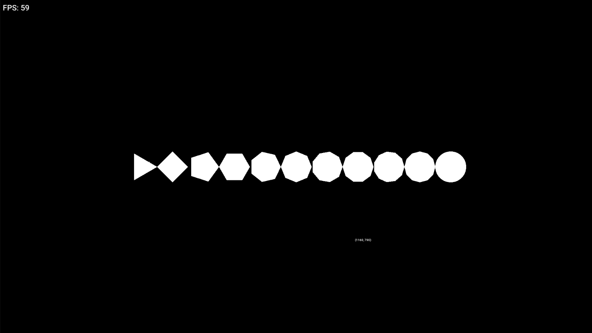
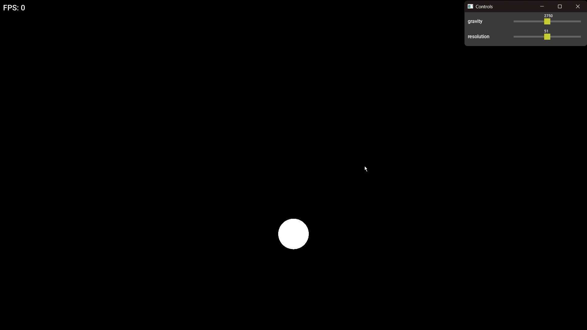
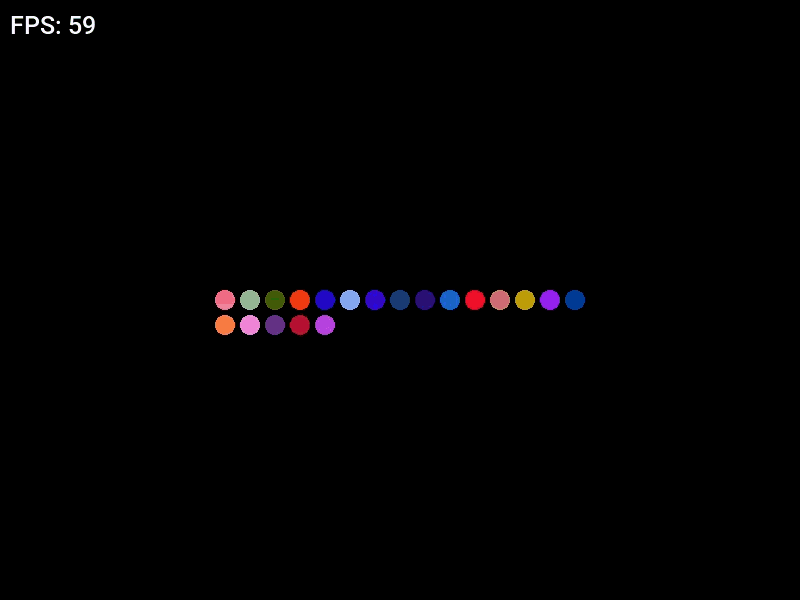

# Simple Pyshics Enginee

A small C++ physics sandbox built with C++ and SDL3.

## Setup and Run

1. Install MinGW with `g++` and make sure it is available in your PATH.
2. Download and install the SDL3 development library and the SDL3_ttf development library:
	- [SDL3](https://github.com/libsdl-org/SDL/releases)
	- [SDL3_ttf](https://github.com/libsdl-org/SDL_ttf/releases)
3. Clone the repository:

```bash
git clone https://github.com/Ayham-Ahmad/TryPhysicsEngine.git
cd TryPhysicsEngine
```

4. Update the SDL paths in `build.bat` if they are different on your computer.
5. Build the project:

```bash
build.bat
```

6. Run the application:

```bash
main.exe
```

## First Step

The first thing we did is to create a circle using triangles, so we use SDL_RenderGeometry() for it.



## Second Step: Gravity

The second step adds gravity so particles accelerate and fall over time.



## Third Step: Collision

The third step adds collisions between particles and the screen boundaries. The current step can run up to only a *1,000* particles at 60 FPS.

This step collision method checks every particle against every other particle to find collisions. It also checks every particle against the screen boundaries on each update.



## Libraries

- [SDL3](https://github.com/libsdl-org/SDL): window creation, rendering, input, and geometry drawing.
- [SDL3_ttf](https://github.com/libsdl-org/SDL_ttf): TrueType font support for on-screen te
